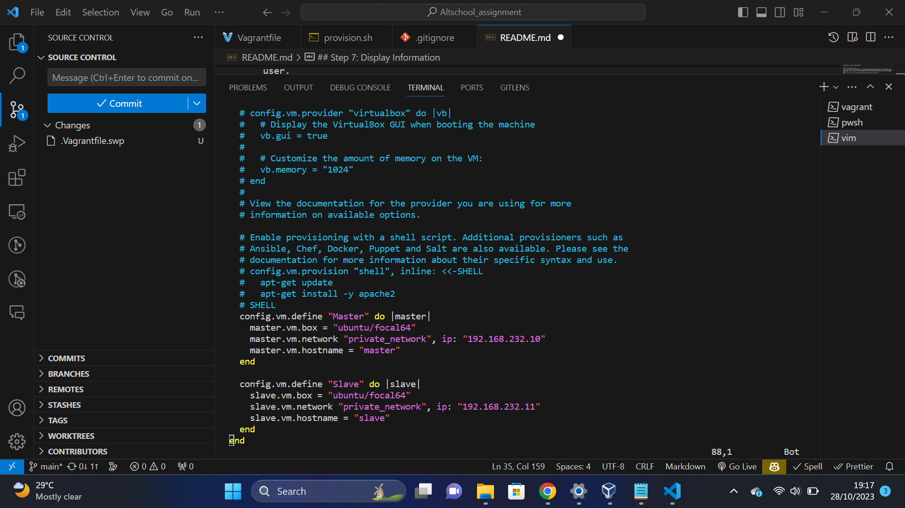
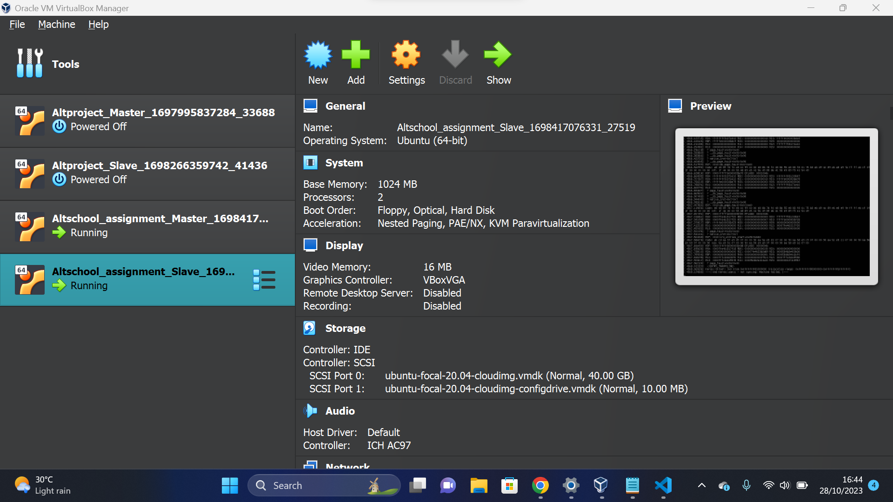
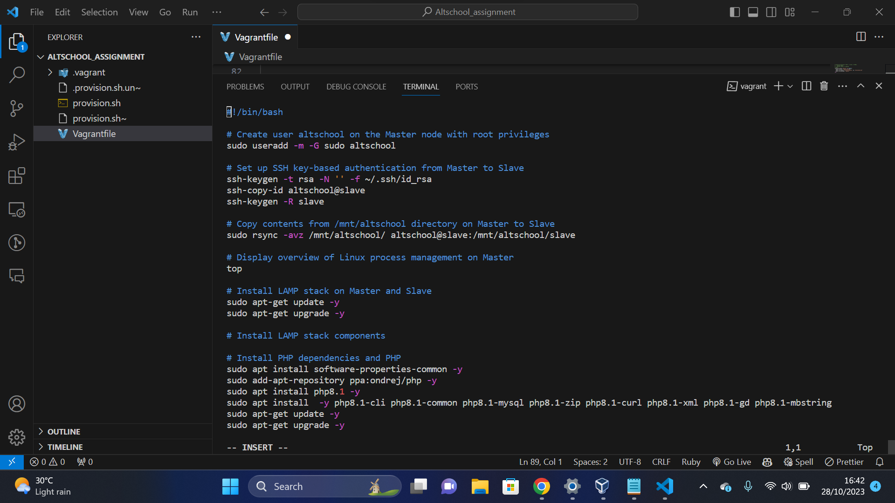
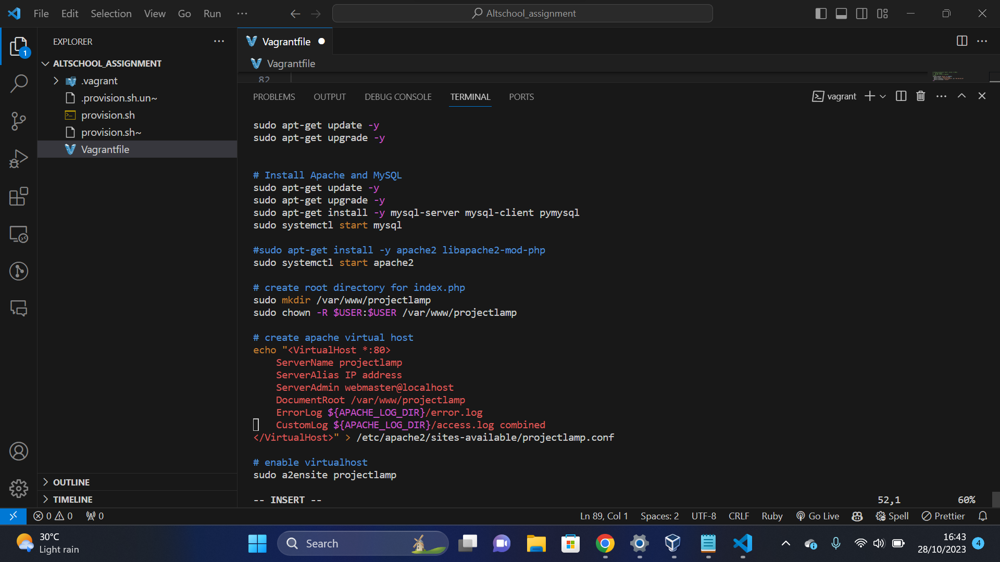
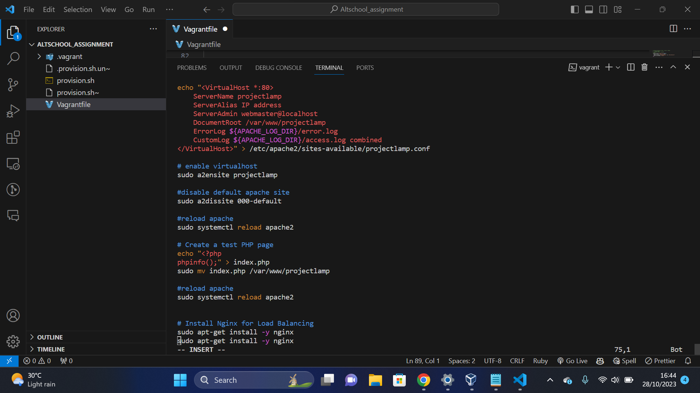
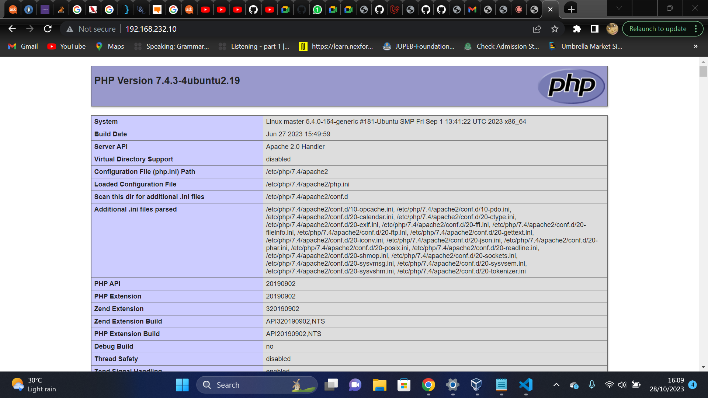

## Deployment of Vagrant Ubuntu Cluster with LAMP Stack

Task Project Task: Deployment of Vagrant Ubuntu Cluster with LAMP Stack

## Documentation

## Step 1: Configure Virtual Machines
The first step in the procedure was to create a Vagrantfile, which defines the configuration of two virtual machines, named "Master" and "Slave." Both machines are assigned private IP addresses and are configured with Ubuntu operating systems.
Memory allocated to each VM was 1024MB.

## Step 2: Provisioning the script
Several tasks were executed on the virtual machines using a provisioner (provision.sh) included in the Vagrantfile. On the 'Master' and 'Slave' virtual machines, it generated a user called 'altschool' and gave it root privileges. It built up a LAMP stack (Linux, Apache, MySQL, PHP) on both VMs, upgraded the system, and installed the required packages. A basic PHP test file was made, and Apache was set up to launch upon boot.

 ## Step 3: Secure MySQL
The script then used the default password ('altschool') for the 'altschool' user to secure the MySQL installation on both virtual machines.

## Step 4: SSH Configuration
Next, on the 'Master' virtual machine, it set up SSH key-based authentication for the 'altschool' user, and on the 'Slave' virtual machine, it permitted password authentication during initial setup.SSH keys were copied from the 'Master' virtual machine to the 'Slave' virtual machine for use by the 'altschool' user.
Next, the 'Slave' virtual machine's password authentication was turned off.

## Step 5: Data Transfer
Using the 'altschool' user, the script moved the contents of the '/mnt/AltSchool' directory from the 'Master' virtual machine to the 'Slave' virtual machine.

## Step 6: Configure Slave
It started the Apache service and changed the 'AllowOverride' setting to 'All' on the 'Slave' virtual machine to modify the Apache configuration.

## Step 7: Display Information
The script finished by confirming the successful deployment of the virtual machines and giving details about the IP addresses of the "Master" and "Slave" VMs.
